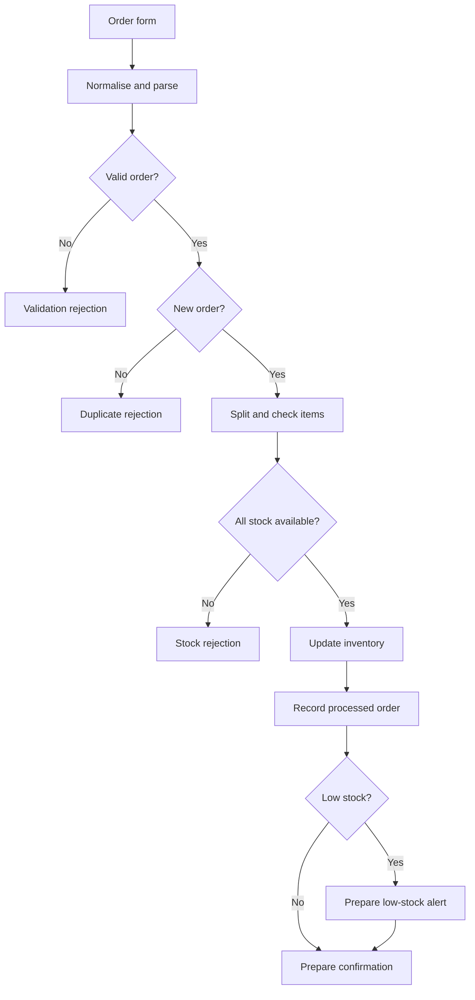
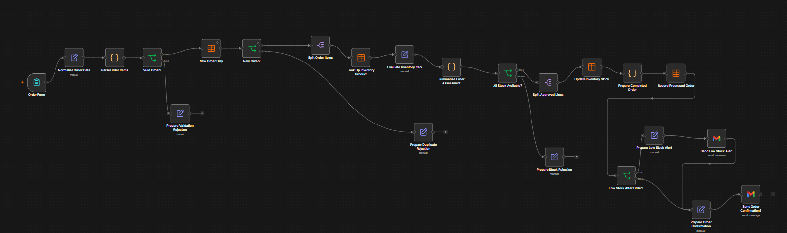
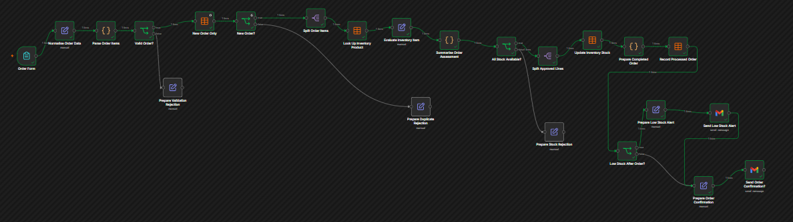
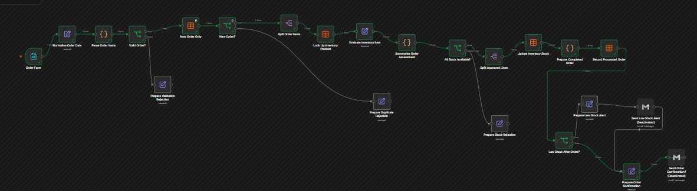
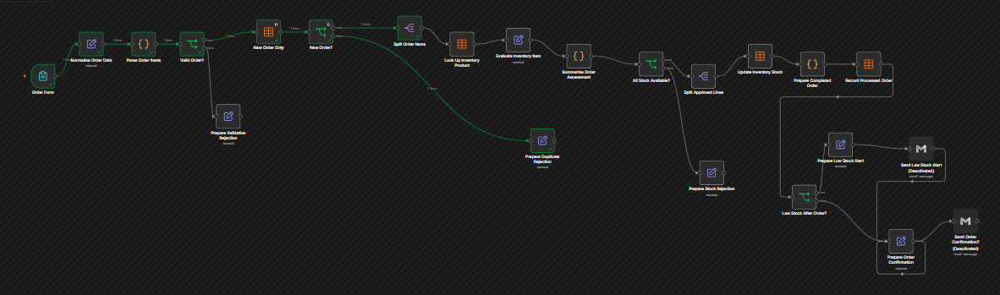
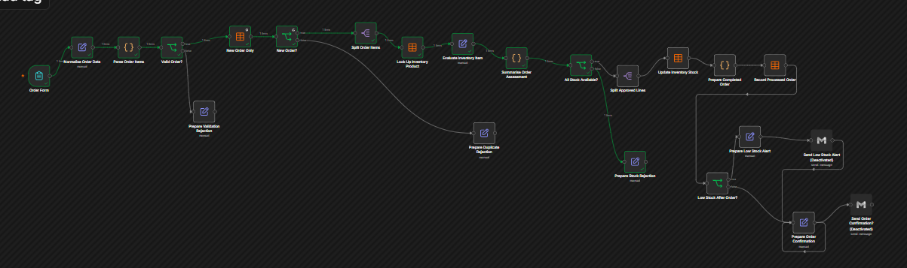

# Order Processing and Inventory Automation

I built this n8n workflow to process fictional customer orders, validate order data, prevent duplicate processing, check inventory, update stock, record completed orders and prepare operational notifications.

The project demonstrates how an order can move through several business rules while keeping rejection paths visible and preventing inventory from being reduced when an order cannot be fulfilled.

## What the Workflow Does

- Collects a fictional order through an n8n form
- Normalises customer and delivery information
- Parses and validates an order-items JSON array
- Rejects invalid orders with a clear reason
- Prevents duplicate order references
- Splits an order into individual product lines
- Looks up each product in an n8n Data Table
- Checks whether all requested stock is available
- Rejects orders containing unavailable stock
- Updates inventory for approved order lines
- Records completed orders in a separate Data Table
- Detects low stock after an order
- Prepares low-stock and order-confirmation notifications

## Workflow Overview

## Project Screenshots

### Complete Workflow

### Successful Order with Low-Stock Alert

### Successful Order without Low-Stock Alert

### Duplicate-Order Prevention

### Stock Rejection

## Tools and n8n Features Used

- n8n Form Trigger
- Edit Fields / Set nodes
- Code nodes
- If conditions
- Split Out
- n8n Data Tables
- Gmail nodes
- Expressions and cross-node references
- Multiple success and rejection paths

## Main Processing Stages

### 1. Receive and Normalise the Order

The form collects an order reference, customer details, delivery information, shipping method, order items and optional notes. The next node trims and standardises the submitted values.

### 2. Validate the Items

A Code node parses `items_json` and checks that it is a non-empty JSON array. Every item must have a SKU, product name and positive whole-number quantity.

Invalid data is routed to the validation-rejection path without changing inventory.

### 3. Prevent Duplicate Orders

The `processed_orders` Data Table is checked for the submitted order reference. Previously processed references follow the duplicate-rejection path.

### 4. Assess Inventory

Approved order lines are separated and matched to products in the `inventory_products` Data Table. The workflow calculates requested quantity, remaining stock and line totals.

### 5. Approve or Reject the Order

The order proceeds only when every product is active and has sufficient stock. Otherwise, the workflow prepares a stock-rejection result identifying the unavailable SKUs.

### 6. Update and Record

For an approved order, inventory quantities are updated and the order is recorded in `processed_orders`. This record supports future duplicate checks.

### 7. Prepare Notifications

The workflow checks whether any product has reached its reorder level. It can prepare a low-stock alert and an order-confirmation message. Gmail credentials and recipients are intentionally excluded from the public template.

## Data Tables Required

Create these two n8n Data Tables before using the template:

### `inventory_products`

| Column | Type |
| --- | --- |
| `sku` | String |
| `product_name` | String |
| `unit_price` | Number |
| `stock_quantity` | Number |
| `reorder_level` | Number |
| `active` | Boolean |

### `processed_orders`

| Column | Type |
| --- | --- |
| `order_reference` | String |
| `customer_email` | String |
| `status` | String |
| `received_at` | String |

## Import and Configuration

1. Import `workflow/order-processing-inventory.sanitised.json` into n8n.
2. Create both Data Tables using the schemas above.
3. Replace the placeholder Data Table IDs in the four Data Table nodes.
4. Connect your own Gmail credential if notifications are required.
5. Replace the example notification recipients.
6. Keep the workflow inactive until all mappings have been reviewed.
7. Test only with fictional data from `sample-data/test-orders.json`.

More detailed instructions are available in [docs/setup.md](docs/setup.md).

## Testing Completed

- Valid order processing
- Invalid order rejection
- Duplicate-order prevention
- Product lookup
- Insufficient-stock rejection
- Inventory reduction for approved orders
- Processed-order recording
- Low-stock routing
- Order-confirmation preparation

## Privacy and Security

The public workflow does not contain live credentials, personal email addresses, webhook identifiers, n8n instance metadata, workflow IDs, project paths or real Data Table IDs.

The screenshots show fictional test executions and do not expose production URLs or credentials. Do not use real customer, payment or delivery information when testing this portfolio project.

## Business Value

This workflow can help a small ecommerce or operations team:

- Reduce manual order checking
- Prevent duplicate fulfilment
- Avoid approving unavailable stock
- Keep inventory quantities current
- Record processed orders consistently
- Detect products that require replenishment
- Make rejection reasons easier to understand

## Possible Improvements

- Transaction-safe stock reservation
- Payment-status verification
- Customer and warehouse email templates
- Automated reorder requests
- CRM or ecommerce-platform integration
- Central error logging and retry handling
- Role-based approval for high-value orders
- Inventory and fulfilment dashboards

## Project Status

**Completed, tested and sanitised for portfolio use**

